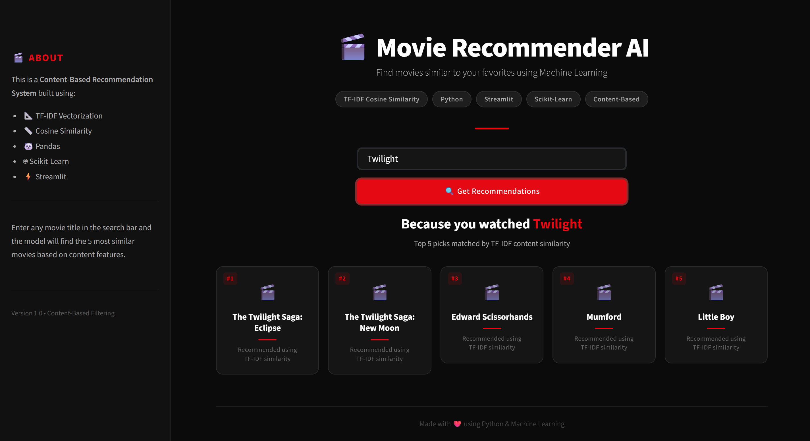
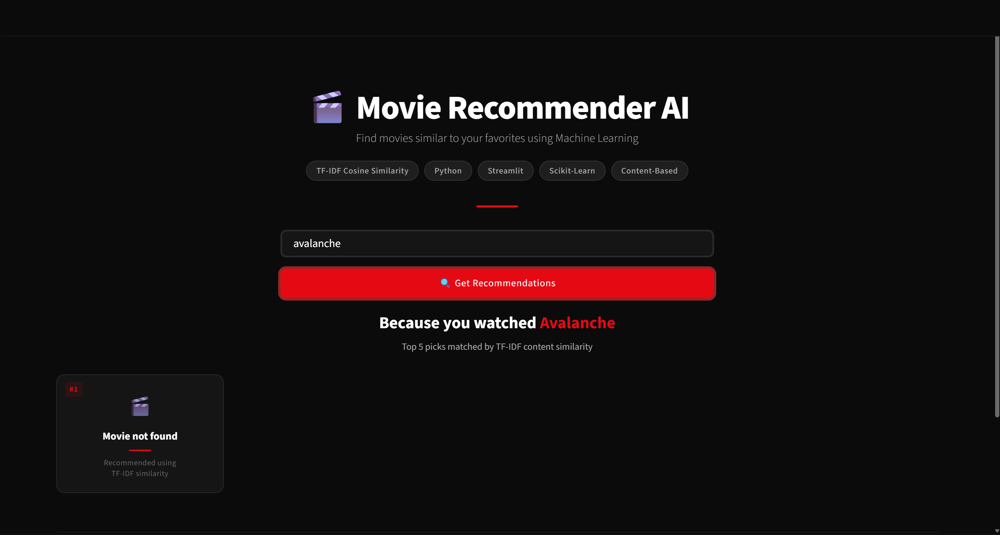

<h1 align="center">🎬 Movie Recommender AI</h1>

<p align="center">
  <em>Discover your next favorite film</em>
</p>

<p align="center">
  
  
  
  
</p>

<p align="center">
  
  
</p>

---

## 📌 Project Overview

**Movie Recommender AI** is a content-based movie recommendation system that suggests 5 similar movies based on plot descriptions. It uses **TF-IDF Vectorization** to convert movie overviews into numerical vectors and **Cosine Similarity** to measure how closely two movies relate to each other — all wrapped in a sleek Streamlit interface.

> Type any movie title → Get 5 recommendations in seconds.

---

## ✨ Features

- 🎯 **Content-Based Recommendations** — Suggests movies similar to your input based on plot descriptions
- 🔢 **TF-IDF Vectorization** — Converts text overviews into meaningful numerical representations
- 📐 **Cosine Similarity** — Measures the angular distance between movie vectors for precise matching
- 🔍 **Case-Insensitive Search** — Works regardless of how you type the movie title
- ⚠️ **Smart Error Handling** — Gracefully handles unknown movies with helpful messages

---

## 📸 Screenshots

### 🏠 Home Page


### ❌ Movie Not Found


---

## ⚙️ How It Works

```
Movie Overview (Text)
        ↓
TF-IDF Vectorization
(Text → Numerical Matrix)
        ↓
Cosine Similarity
(Compare all movie vectors)
        ↓
Top 5 Most Similar Movies
        ↓
Streamlit UI
(Display as interactive cards)
```
## 📁 Project Structure

```
movie-recommender-ai/
│
├── app.py                  # Streamlit UI — main entry point
├── preprocess.py           # Data cleaning and TF-IDF matrix generation
├── recommender.py          # Core recommendation logic (recommend() function)
├── cleaned_movies.csv      # Preprocessed movie dataset
├── README.md              
│
├── data/
│   ├── tmdb_5000_movies.csv    # Raw TMDB movie metadata
│   └── tmdb_5000_credits.csv   # Raw TMDB credits data
│
└── screenshots/
    ├── home_page.png           # UI screenshot — home state
    └── movie_not_found.png     # UI screenshot — error state
```

---

## 🚀 Installation & Setup

### 1. Clone the Repository

```bash
git clone https://github.com/meimei92/movie-recommender.git
cd movie-recommender
```

### 2. Install Dependencies

```bash
pip install pandas numpy scikit-learn streamlit
```

### 3. Run the App

```bash
streamlit run app.py
```
## 🎮 Usage

1. Launch the app with `streamlit run app.py`
2. Type a movie title in the search bar (e.g. `Inception`, `The Dark Knight`, `Avatar`)
3. Click **🔍 Get Recommendations**
4. View your 5 personalized movie recommendations as cards

> Movie titles are case-insensitive — `inception`, `INCEPTION`, and `Inception` all work.

---

## 🔮 Future Improvements

| Feature | Description |
|---|---|
| 🖼️ **Movie Posters** | Fetch and display posters via the TMDB API |
| 🎭 **Genre Filtering** | Let users filter recommendations by genre |
| 🔎 **Fuzzy Search** | Handle typos and partial movie titles gracefully |
| 🤝 **Hybrid Recommender** | Combine content-based + collaborative filtering |
| ☁️ **Cloud Deployment** | Deploy to Streamlit Cloud, Heroku, or Render |

---

## 🛠️ Tech Stack

| Tool | Purpose |
|---|---|
| **Python** | Core programming language |
| **Pandas** | Data loading and manipulation |
| **NumPy** | Numerical computations |
| **Scikit-learn** | TF-IDF Vectorizer & Cosine Similarity |
| **Streamlit** | Interactive web UI |
| **TMDB Dataset** | Movie metadata and plot descriptions |

---

## 📄 License

This project is open-source and available under the [MIT License](LICENSE).

---
